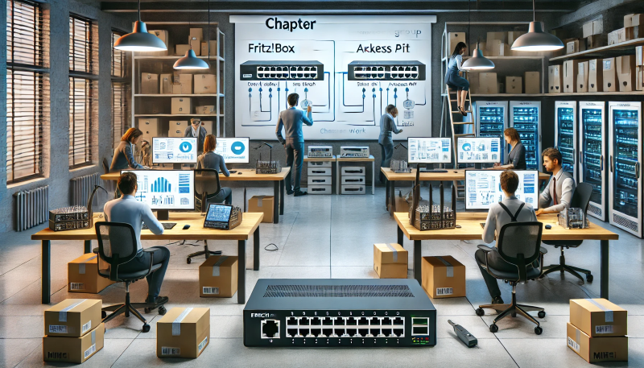

# Kapitel 3: Netzwerk in einer Büroumgebung realisieren

In diesem Kapitel werden Sie ...

- ... das zuvor geplante Netzwerk aufbauen,
- ... indem Sie die Realisierung mit Fritz!Box-, Netgear- sowie Mikrotik-Hardware durchführen.

## Handlungssituation

Das Steuerberaterbüro ist sehr zufrieden mit der Vorstellung Ihrer Planungen und auch das Gesamtangebot konnte nach kleineren Anpassungen überzeugen. Das Steuerberaterbüro möchte das geplante Konzept realisieren. Dazu sind parallel neben dem Geschäftsbetrieb mehrere Teilabschnitte vereinbart worden, die ein schrittweises Vorgehen erlauben. Im ersten Abschnitt wird im Labor der ChangeIT GmbH die grundlegende Installation soweit durchgeführt, dass der Rollout im zweiten Abschnitt beim Kunden an einem Werktag erfolgen kann.

## Kompetenz 3.0: Hardware einrichten

Sie haben sich in einer Laborumgebung innerhalb der ChangeIT GmbH einen Teil der Hardware zusammengestellt, um ein Proof of Concept durchzuführen und entsprechende Einstellungen zu testen. Es geht nun daran, die Einrichtung der Hardware für den Einsatz beim Kunden vorzubereiten.

### A|3.1: Einrichtung der kaskadierten FRITZ!Boxen

Richten Sie die beiden FRITZ!Box-Modelle entsprechend der Planungen ein. Dazu sollen Ihnen folgende Hinweise einen Anhaltspunkt geben.

1. Richten Sie zuerst die FRITZ!Box 7590 als 1. Router und damit als "künstliche DMZ" ein.
2. Richten Sie in der FRITZ!Box 7590 ein Gastnetzwerk auf LAN 4 ein.
3. Richten Sie in der FRITZ!Box 7590 ein WLAN für die "künstliche DMZ" ein.
4. Richten Sie in der FRITZ!Box 7590 ein Gast-WLAN ein.
5. Richten Sie die FRITZ!Box 3270 als 2. Router und damit als Kaskade ein (nutzen Sie in den Interneteinstellungen die Option ""). //TODO
6. Verbinden Sie die FRITZ!Box 7590 (LAN Port 2) und die FRITZ!Box 3270 (LAN Port 1) miteinander.

Nach fertiger Einrichtung der Hardware prüfen Sie folgende Rahmenbedingungen:

- IP-Adresse, Netzadresse, Subnetzmaske & Gateway des internen Netzes via LAN
- IP-Adresse, Netzadresse, Subnetzmaske & Gateway des Netzes der "künstlichen DMZ" via LAN
- IP-Adresse, Netzadresse, Subnetzmaske & Gateway des Gastnetzes via LAN
- IP-Adresse, Netzadresse, Subnetzmaske & Gateway des Netzes der "künstlichen DMZ" via WLAN
- IP-Adresse, Netzadresse, Subnetzmaske & Gateway des Gastnetzes via WLAN
- Konfigurieren Sie einen weiteren Client manuell (also ohne DHCP) so, dass dieser am Gastnetz teilnehmen kann.

### M|3.0: Konfiguration der Fritz!Box-Modelle //TODO

### A|3.2: Einrichtung des Switches NetGear GS308e inkl. VLAN

Um VLAN in dem Aufbau nutzen zu können, wird der VLAN-fähige Switch NetGear GS308e eingerichtet. Dazu gehen Sie wie folgt vor:

1. Verbinden Sie den Switch sowie ein Notebook mit dem Netz der "künstlichen DMZ".
2. Öffnen Sie die Konfigurationsseite des Switches.
3. Richten Sie die benötigten VLANs ein. Für das WLAN wird ein Trunk-Port benötigt, von den zwei Fritz!Box Modellen kommend sollen ferner die Netze "künstliche DMZ", "internes Netz" sowie "Gastnetz" portbasiert ins VLAN aufgenommen werden.
4. Es sollten zur Prüfung, ob der Switch wie gewünscht arbeitet, je VLAN zwei Ports mit dem jeweiligen VLAN belegt werden. Am Ende bleiben zwei Ports als Trunk.

### M|3.1: Konfiguration des NetGear GS308e Switches

//TODO

### M|3.2: Manual zum NetGear GS308e Switch

https://www.downloads.netgear.com/files/GDC/GS105EV2/WebManagedSwitches_UM_EN.pdf

### A|3.3: Einrichtung des MikroTik Access Point

//TODO

### M|3.3: Konfiguration des MikroTik hap Lite Access Point

//TODO

### M|3.4: Manual zum MikroTik hap Lite Access Point

https://help.mikrotik.com/docs/display/UM/hAP+lite

