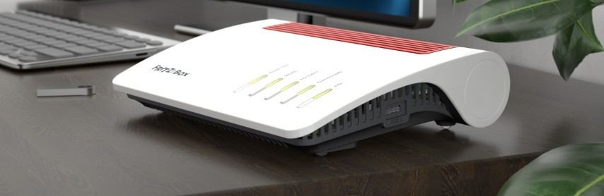

# Fallbeispiel: FRITZ!Box 7590 AX

In diesem Kapitel ...

- ... wiederholen Sie netzwerktechnische Grundlagen.
- ... arbeiten Sie am Beispiel eines Endgerätes für Small Office an Home (SOHO).
- ... vertiefen Sie Ihre Kenntnisse zu Netzwerken.

---

## Handlungssituation

Ein Mitarbeiter der ChangeIT GmbH hat den Auftrag die Netzwerkinfrastruktur für einen Steuerberater neu zu planen. Das Steuerberater-Büro besteht aus den zwei Niederlassungen in Hannover und in Oldenburg. Sie sollen den Mitarbeiter dahingehend unterstützen, dass Sie die technischen Fragestellungen für den Kunden klären. Ihr Kollege hat sich bereits in Absprache mit dem Kunden für die AVM FRITZ!Box 7590 AX an den Glasfaseranschlüssen der Steuerberater-Büros entschieden, da jener die Administration nach der Ersteinrichtung selbst übernehmen möchte und sich mit den Produkten von AVM beschäftigt hat.

---

---

