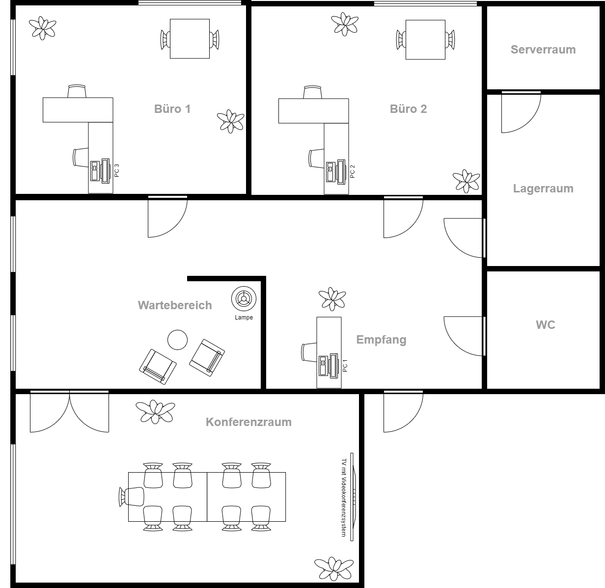

# Fallbeispiel: FRITZ!Box 7590 AX

In diesem Kapitel ...

- ... wiederholen Sie netzwerktechnische Grundlagen.
- ... arbeiten Sie am Beispiel eines Endgerätes für Small Office an Home (SOHO).
- ... vertiefen Sie Ihre Kenntnisse zu Netzwerken.

---

## Handlungssituation

Ein Mitarbeiter der ChangeIT GmbH hat den Auftrag die Netzwerkinfrastruktur für einen Steuerberater neu zu planen. Das Steuerberater-Büro besteht aus den zwei Niederlassungen in Hannover und in Oldenburg. Sie sollen den Mitarbeiter dahingehend unterstützen, dass Sie die technischen Fragestellungen für den Kunden klären. Ihr Kollege hat sich bereits in Absprache mit dem Kunden für die AVM FRITZ!Box 7590 AX an den Glasfaseranschlüssen der Steuerberater-Büros entschieden, da jener die Administration nach der Ersteinrichtung selbst übernehmen möchte und sich mit den Produkten von AVM beschäftigt hat.

---

## Kompetenz 1: Funktionalität von Hardwareprodukten analysieren

Da der SOHO-Router bereits festgelegt ist, Sie diesen aber noch nicht wirklich kennen, möchten Sie sich in das Gerät neu einarbeiten. Die Informationslage im Internet ist gut, es steht neben der Produktwebseite auch ein ausführliches Handbuch zur Verfügung. Ferner werden auf vielen Webseiten oder in Foren von Communities spezielle Produktfunktionen erläutert. Auf Basis dieser Informationen soll eine Übersicht entstehen, welche die Funktionalität der Hardware darstellt.

---

### A|0: FRITZ!Box 7590 AX analysieren

Um die Funktionalität der Hardware beim Kunden einschätzen zu können, analysieren Sie nach vier Schwerpunkten geordnet die FRITZ!Box 7590 AX:

- LAN / WLAN
- VPN & Sicherheit
- Telefon & Smart Home
- Weitere Dienste z.B. NAS

Fertigen Sie zu den Funktionen eine Übersicht als Mindmap an, die zur weiteren Recherche eine Grundlage bilden soll.

---

## M|0: Webseite zum Produkt FRITZ!Box 7590 AX

Sie finden die Produktvorstellung auf der [Herstellerseite](https://avm.de/produkte/fritzbox/fritzbox-7590-ax/).

---

## M|1: Produkthandbuch FRITZ!Box 7590 AX

Sie finden die das Handbuch auf der [Herstellerseite](https://assets.avm.de/files/docs/fritzbox/fritzbox-7590-ax-v2/fritzbox-7590-ax-v2_man_de_DE.pdf).

---

## A|1: Informationen zur FRITZ!Box 7590 AX vervollständigen

Der Kunde hat mit Ihrem Kollegen zusammen einen Fragenkatalog zur FRITZ!Box 7590 AX entwickelt, um einige Informationen über den Router zu erhalten. Prüfen Sie anhand Ihrer Mindmap aus dem vorherigen Arbeitsauftrag, ob Sie diese beantworten können. Sollten noch Lücken in dem vorherigen Ergebnis bestehen, vervollständigen Sie die Aspekte:

- Wie können die zwei Niederlassungen sicher miteinander verbunden werden?
- Wäre es möglich eine DMZ (Demilitarisierte Zone) einzurichten, um Webdienste wie eine Nextcloud aus den eigenen Räumlichkeiten anzubieten?
- Welche Optionen bestehen, um Kunden direkt über die FRITZ!Box 7590 AX, aber auch über einen weiteren Access Point mit einem Gast-WLAN zu versorgen?
- Inwiefern unterstützt der Router VLAN?
- Welche Fallback-Option besteht, wenn die Glasfaser ausfallen sollte und dennoch eine Internetverbindung benötigt wird?
- Wie kann der Mitarbeiter von daheim im Homeoffice sicher auf die Daten im Büro zugreifen?
- Welche Möglichkeiten werden für die Anbindung der Telefone angeboten?
- Welche Apps zum Router gibt es auf dem Markt?

---

## Kompetenz 2: LAN- und WLAN-Infrastruktur planen

Das Steuerberater-Büro hat sich dazu entschieden einen eigenen Nextcloud-Server für den Datenaustausch mit Klienten einzusetzen. Außerdem soll die Firmenwebseite von einem eigenen Server gehostet werden. Um diese Dienste sicher anbieten zu können, soll das Netzwerk entsprechend geplant werden. Dabei soll direkt der Aufbau des WLAN mit bedacht werden. Der Auszug aus dem Lastenheft beschreibt die umzusetzenden Funktionen.

---

### M|2: Auszug vom Lastenheft zum Steuerberater-Büro

#### Funktionale Anforderungen

1. Nutzung des internen WLANs über drei Büros (es liegen zwei Unifi.
2. Nutzung des Gast-WLANs über drei Büros und dem Wartebereich
3. Nutzung des LANs für alle Desktop-PCs
4. Nutzung des LANs für zwei IP-Kameras (Reolink B4K11)
5. Nutzung des LANs für die Server
6. Nutzung des LANs für die IP-Klingel (Metzler VDM10) am Gebäude und deren Inneneinheit (Metzler VDM10 7 Zoll)
7. Einrichtung einer DMZ für Server der Nextcloud & Webseite
8. Sichere Verbindung zwischen den Standorten Hannover und Oldenburg (in OL ist bereits eine FRITZ!Box 7590 AX durch einen anderen Dienstleister eingesetzt)
9. Sichere Verbindung der Mitarbeiter aus dem Home-Office zum Standort Hannover
10. NAS zur Nutzung für den schnellen Datenaustausch nicht personenbezogener Daten (Ablage Rechtsgrundlagen etc.)
11. Nutzung zweier IP-Telefone (Yealink SIP-T41P) in den Büros
12. Nutzung eines Analogtelefons mit TAE-Stecker (Gerät ist vorhanden) als Fallback direkt am Router
13. Nutzung eines IP-Telefons (Yealink SIP-T41P) am Empfang
14. Nutzung eines schnurlosen DECT-Telefons (FRITZ!Fon C6) mit Basis am Empfang
15. Nutzung eines Smartphones als Notfall-Telefonnummer
16. Nutzung des Fax
17. Nutzung des Anrufbeantworters außerhalb der Sprechzeiten
18. Fallback für die Glasfaseranbindung mittels LTE
19. Nutzung einer FRITZ!DECT 500 LED-Leuchte im Wartebereich
20. Nutzung eines FRITZ!DECT 302 Thermostats für die Heizung im Wartebereich
21. Nutzung eines WLAN-Druckers ()
22. Nutzung eines USB-Flachbettscanners
23. Nutzung eines Mediaservers für ein Wiedergabegerät im Wartebereich
24. Nutzung eines Videokonferenzsystems im Konferenzraum (Logitech Rally Plus)
25. Energiesparmodi nutzen
26. Priorisierung von VoIP

#### Grundriss der Räumlichkeiten

---

### A|2: Entwicklung der LAN-Infrastruktur

Auf Basis der funktionalen Anforderungen sowie des Grundrisses zum Steuerberatungsbüro sollen Sie im nächsten Schritt die LAN-Infrastruktur planen.

1. Legen Sie einen logischen Netzwerkplan für den Kunden zum LAN an.
2. Berücksichtigen Sie alle Anforderungen, die im Lastenheft genannt sind.
3. Wählen Sie Beispiel-IP-Adressen für die genannten Endgeräte.
4. Übernehmen Sie in einem separaten Modell den Gebäudeplan und treffen Sie Entscheidungen dahingehend, wo Endgeräte positioniert werden können.

---

### A|3: Entwicklung der WLAN-Infrastruktur

Auf Basis der funktionalen Anforderungen sowie des Grundrisses zum Steuerberatungsbüro sollen Sie im nächsten Schritt die Infrastruktur planen.

1. Legen Sie einen logischen Netzwerkplan für den Kunden zum WLAN an.
2. Berücksichtigen Sie alle Anforderungen, die im Lastenheft genannt sind.
3. Wählen Sie Beispiel-IP-Adressen für die genannten Endgeräte.
4. Übernehmen Sie in einem separaten Modell den Gebäudeplan und treffen Sie Entscheidungen dahingehend, wo Endgeräte positioniert werden können.

---

## Kompetenz 3: Telefonie- und DECT-Infrastruktur planen

Im Steuerberater-Büro werden unterschiedliche Telefonie-Geräte eingesetzt. Auch die Smart-Home-Komponenten funktionieren vielfach über den DECT-Standard. Damit der Kunde hierzu eine Übersicht bekommt, sind die Planungen zu konkretisieren.

---

### A|4: Entwicklung der Telefonie- und DECT-Infrastruktur

Auf Basis der funktionalen Anforderungen sowie des Grundrisses zum Steuerberatungsbüro sollen Sie im nächsten Schritt die Infrastruktur planen.

1. Legen Sie einen logischen Plan für den Kunden für Telefonie und DECT an.
2. Berücksichtigen Sie alle Anforderungen, die im Lastenheft genannt sind.
3. Übernehmen Sie in einem separaten Modell den Gebäudeplan und treffen Sie Entscheidungen dahingehend, wo Endgeräte positioniert werden können.

---

## Kompetenz 4: Sicherheit planen

Das Steuerberater-Büro möchte eine Aufstellung darüber haben, inwiefern die Sicherheit bei einzelnen Diensten gewährleistet ist. Hierzu sollen neben WLAN und VPN auch die Möglichkeiten der Absicherung vor Ort in den Räumen (technisch organisatorische Maßnahmen) aufgegriffen werden.

---

### A|5: DMZ planen

Auf Basis der funktionalen Anforderungen sowie des Grundrisses zum Steuerberatungsbüro sollen Sie im nächsten Schritt die Infrastruktur planen.

1. Planen Sie eine DMZ mittels Einsatz einer zweiten FRITZ!Box 7590 AX am Standort Hannover ein und stellen Sie dieses schematisch dar.
2. Berücksichtigen Sie alle Anforderungen, die im Lastenheft genannt sind.
3. Übernehmen Sie in einem separaten Modell den Gebäudeplan und treffen Sie Entscheidungen dahingehend, wo Endgeräte positioniert werden können.

---

### A|6: VLAN bzw. Gastnetzwerke planen

Auf Basis der funktionalen Anforderungen sowie des Grundrisses zum Steuerberatungsbüro sollen Sie im nächsten Schritt die Infrastruktur planen.

1. Legen Sie einen Plan für mögliche Nutzung von VLAN und die Gastnetzwerke an.
2. Berücksichtigen Sie alle Anforderungen, die im Lastenheft genannt sind.
3. Übernehmen Sie in einem separaten Modell den Gebäudeplan und treffen Sie Entscheidungen dahingehend, wo Endgeräte positioniert werden können.

---

### A|7: VPN-Konzept erstellen

Auf Basis der funktionalen Anforderungen sowie des Grundrisses zum Steuerberatungsbüro sollen Sie im nächsten Schritt die LAN-Infrastruktur planen.

1. Legen Sie einen Plan für die VPN-Verbindung zum Standort Oldenburg sowie für die Home-Office-Mitarbeiter an. Stellen Sie schematisch die Verbindungen dar.
2. Berücksichtigen Sie alle Anforderungen, die im Lastenheft genannt sind.
3. Übernehmen Sie in einem separaten Modell den Gebäudeplan und treffen Sie Entscheidungen dahingehend, wo Endgeräte positioniert werden können.

---

## Kompetenz 4: weitere Dienste planen

Neben der zuvor erarbeiteten Infrastruktur sind auch weitere Dienste im Lastenheft aufgeführt, die bisher noch nicht geplant sind. Diese sollen an dieser Stelle in den Fokus genommen werden.

---

### A|8: weitere Dienste berücksichtigen

Auf Basis der funktionalen Anforderungen sowie des Grundrisses zum Steuerberatungsbüro sollen Sie im nächsten Schritt die Infrastruktur planen.

1. Planen Sie alle weiteren Dienste und Anforderungen aus dem Lastenheft, die bisher noch nicht adressiert wurden. Ergänzen Sie dazu die bisherigen Planungen oder legen Sie neue Schemata an.
2. Berücksichtigen Sie alle Anforderungen, die im Lastenheft genannt sind.
3. Übernehmen Sie in einem separaten Modell den Gebäudeplan und treffen Sie Entscheidungen dahingehend, wo Endgeräte positioniert werden können.

---

## Kompetenz 5: Kalkulation eines Angebots

### A|9: Kalkulation von Handelswaren

### A|10: Interner Stundensatz

---

## Kompetenz 6: Präsentation einer Infrastrukturplanung

Die umfangreichen Planungen aus den vergangenen Schritten sollen dem Kunden zur Abnahme vorgestellt werden. Da auch technische Mitarbeiter:innen bei dem Meeting anwesend sind, sollen die Fachtermini aufgegriffen werden. Bereiten Sie sich aber dennoch darauf vor, dem Kunden bei Nachfragen die einzelnen Technologien auch erläutern zu können.

---

### A|11: Erstellung einer Präsentation

Erstellen Sie eine Präsentation, welche alle Planungen für das Steuerberatungsbüro aufgreift. Die Präsentation soll genau 15 Minuten dauern und optisch gut aufbereitet sein. Wichtig ist auch, dass Abbildungen / Schemata gut lesbar sind und "geführt" präsentiert werden. Die Begriffe müssen nicht alle im Detail erläutert sein, aber bei Rückfragen müssen Sie in der Lage sein, Rede und Antwort zu stehen.

---

---

